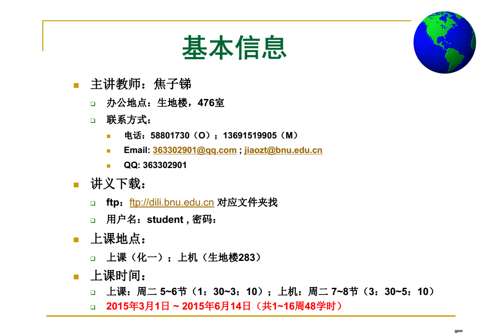

hello
===

I like [baidu](www.baidu.com).

hello,justin.

hello,Xinyu Zou.

相邻的两行，如果彼此之间没有任何的空行，那么这些东西就是一起的。然后换行符被默认的转化为一个空格。

**粗体**
*斜体*

加粗
===

分割线
******

***粗斜体***

# 标题级别
## 标题级别
### 标题级别

# 列表
1. 第一项
2. 必须要加空格
3. 论空格在md中的作用 

# 无顺序列表
- 天
- 底
- 人
- 论空格在markdown中的 ***重要*** 作用
- 论空格在markdown中的**重要**作用
- ***重要***
* 论点和*的差别
* 注意点和星星之间的转变必定会出现一个空行

**基本上就是*或者是#**

`#include<iostream>`
`#include <vector>`

***我还是不懂换行，似乎在别的md软件里面，必须要在行的后面加上两个空格才能换行。但是在VS code里面似乎单纯的用enter就能换行。应该是经过了优化。***

## 插入图片
- *格式*：！[image_name] image_url)
- *例子*：

- **attention**: 不要有任何的空格，**空格**在这个里面是个很巧妙的东西。
- *本地图片*:

**注意**：首先就是说你这个本地图片要用相对路径，然后就是名字中间不能有空格。
**注意**：`./`表示在当前的文件夹里面

## 插入外部资源
*包括链接图片等等*
1. 首先就是要声明，用的是[]
2. 然后就是说要进行一个输入，用的是(**资源的位置或者名字**，包括网址、相对路径)

## 另外
- `表示插入代码`
- 删除线：~~删除~~
- 高亮线：==高亮==
- md支持远程索引：
*比如*：
![图片][baidu的网址]

[图片](https://www.baidu.com/img/bd_logo1.png)
[外部链接](http://www.baidu.com)

**加不加感叹号有啥子区别？？**
似乎加不加就是是不是显示图片的差别，加上之后就是显示在md里面，不加就是不显示，单纯一个外部链接。

**注意在末尾必须要加上:进行解释**

...

最后附上百度的地址
====

[百度网址][baidu的网址]
**注意**：如果不是图片就不要随意的加上！

[index1]:(https://www.baidu.com/img/bd_logo1.png)
[index2]:(local_respective_address)
[baidu的网址]:(http://www.baidu.com)
********
********

**md里里面仅仅有左对齐，其余的全都没有**